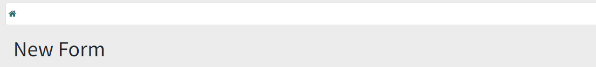

# Create A Form On Portal In Odoo

    
    

## Índice

* [Índice](#índice)

* [Project description](#project-description )

* [Estado del proyecto](#Estado-del-proyecto)

* [Características de la aplicación y demostración](#Características-de-la-aplicación-y-demostración)

* [Acceso al proyecto](#acceso-proyecto)

* [Tecnologías utilizadas](#tecnologías-utilizadas)

* [Personas Contribuyentes](#personas-contribuyentes)

* [Personas-Desarrolladores del Proyecto](#personas-desarrolladores)

* [Licencia](#licencia)

* [Conclusión](#conclusión)

## Project description

*Odoo has multiple advantages for an internal user, but what about those who are portal?*

In this repository you will find the necessary guidelines to create a form for portal-type users, this can accommodate the needs of the backend programmer to request information that is linked to any existing module.
