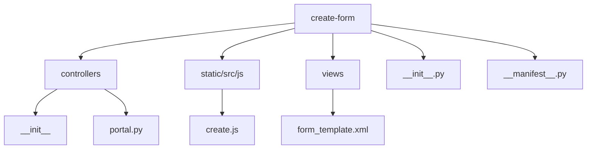
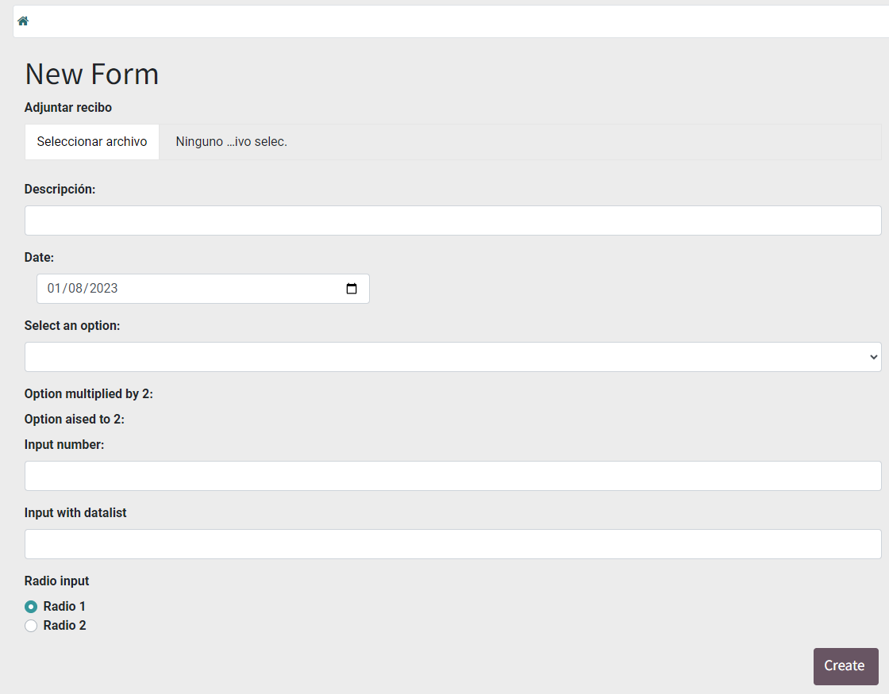
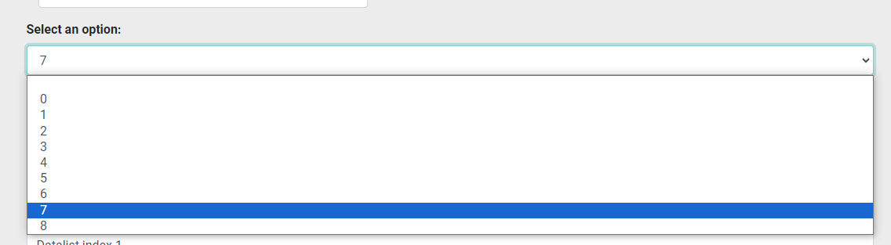
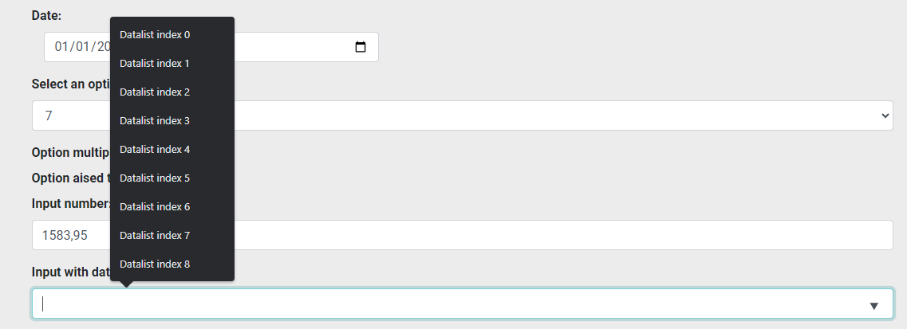
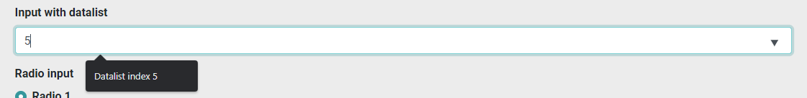

# Create A Form On Portal In Odoo


<p align="center">
    
    
</p>

## Índice

* [Índice](#índice)

* [Project description](#project-description)

* [Project structure](#project-structure)
    * [controllers](#controllers)
    * [static/src/js](#static/src/js)
    * [views](#views)
* [Form template](#form-template)


---

## Project description

*Odoo has multiple advantages for an internal user, but what about those who are portal?*

Welcome to our repository! 
Here, you'll discover comprehensive guidelines to craft a versatile portal-type user form, tailored to fulfill the requirements of backend programmers. The form is designed to facilitate information retrieval associated with any existing module seamlessly. Our aim is to streamline the process, enhance efficiency, and create a user-friendly experience.

---

## Project structure

<!-- ```
create-form
|   controllers
|   |   __init__.py
|   |   portal.py           
|   static/src/js
|   |   create.js         
|   views
|   |   form_template.xml         
|   __init__.py
|   __manifest__.py
``` -->



### controllers
<p style="margin-top:20px">
Dentro de "controllers" podéis encontrar la clase CustomerPortal de tipo portal.CustomerPortal que tiene dos rutas:
</p>

<ul>
    <li><p>La primera, "/my/form" redirecciona a la view "form_template", se le puede añadir los argumentos que se necesiten en <b><i>vals</i></b>.</p>
    <li><p style="margin-top:10px">En "/my/form/submit" se recogen los datos de la pagina con "post.get('nombre de la variable')", con esto se propoen crear una nueva instancia del modelo <b>model.name</b> pasando las "vals". Para conseguir guardar el archivo qu hayamos adjuntado, se ejecutan las siguientes líneas 39-69. Por último, se redirige a "/my".</p>
</ul>

### static/src/js
<p style="margin-top:20px">
Para poder hacer operaciones in situ, se ha decidido utilizar JavaScript, en este archivo en donde se asignan un par de operaciones.
</p>

```Python
function calculateOperation() {
    var option_number = select_option.value;
    var electec_option = null;
    select_options.forEach(option => {
        if (option.number == option_number){
            electec_option = option;
        }
        })
    mult.textContent = electec_option.mult_2
    exp.textContent = electec_option.exp_2
}
```

### views
<p style="margin-top:10px">
Esta carpeta contiene todas las vistas, en el caso actual se muestra un ejemplo de formulario que abarca distintos inputs para el usuario.
</p>

---

## Form template

<p align="center">
    
</p>


<p align="center">
    
</p>

<p align="center">
    
</p>

<p align="center">
    
</p>

<p align="center">
    
</p>

In this repository you will find the necessary guidelines to create a form for portal-type users, this can accommodate the needs of the backend programmer to request information that is linked to any existing module.
