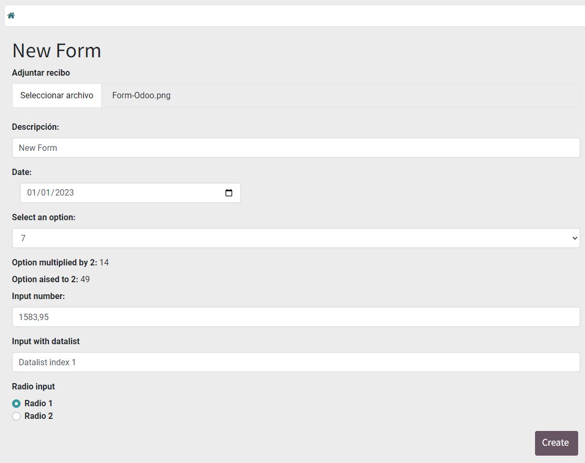

# Create A Form On Portal In Odoo


<p align="center">
    
    
</p>

## Índice

* [Índice](#índice)

* [Project description](#project-description)

* [Project structure](#project-structure)
    * [controllers](#controllers)
    * [static/src/js](#static/src/js)
    * [views](#views)
* [Form template](#form-template)


---

## Project description

*Odoo has multiple advantages for an internal user, but what about those who are portal?*

Welcome to our repository! 
Here, you'll discover comprehensive guidelines to craft a versatile portal-type user form, tailored to fulfill the requirements of backend programmers. The form is designed to facilitate information retrieval associated with any existing module seamlessly. Our aim is to streamline the process, enhance efficiency, and create a user-friendly experience.

---

## Project structure


<p style="margin-top:30px"></p>

### controllers
<p>Within the "controllers" folder, you can find the CustomerPortal class of type portal.CustomerPortal, which has two routes:</p>

<ul>
    <li><p>The first one, "/my/form," redirects to the "form_template" view, and you can add any necessary arguments in <b><i>vals</i></b>.</p></li>
    <li><p style="margin-top:10px">In "/my/form/submit," the data from the page is collected using "post.get('variable name'). With this, we aim to create a new instance of the <b>model.name</b> model, passing the "vals". To save the attached file, the following lines 39-69 are executed. Finally, it redirects to "/my".</p></li>

</ul>

### static/src/js
<p>To perform operations in-situ, it has been decided to use JavaScript in this file where a couple of operations are assigned.</p>

```Python
function calculateOperation() {
    var option_number = select_option.value;
    var electec_option = null;
    select_options.forEach(option => {
        if (option.number == option_number){
            electec_option = option;
        }
        })
    mult.textContent = electec_option.mult_2
    exp.textContent = electec_option.exp_2
}
```

### views
<p>This folder contains all the views. In the current case, an example of a form is shown, which covers different inputs for the user.</p>

---

## Form template
<p>The form displayed in this repository offers various possibilities, including:</p>

* Ability to attach a file.
* Add a description.
* Specify a date.
* Select an option that performs the following two operations: multiplication and exponentiation by 2.
* Input a number with a sensitivity of 0.01.
* Perform a search within a list.
* Choose between two options using a radio input.

<p align="center">
    
</p>


When selecting an option, a dropdown menu (select-option) is displayed, allowing you to choose a number from the available options.

<p align="center">
    
</p>


The last input allows you to type and perform a quick search, especially useful when dealing with an extensive list. This search functionality helps users easily find specific items within the list by filtering as they type.
<p align="center">
    
</p>

<p align="center">
    
</p>

This last image displays the result after filling out the entire form. The only step remaining is to click on the "Create" button, which will then save the information obtained from the form into the relevant model. 
<p align="center">
    
</p>
